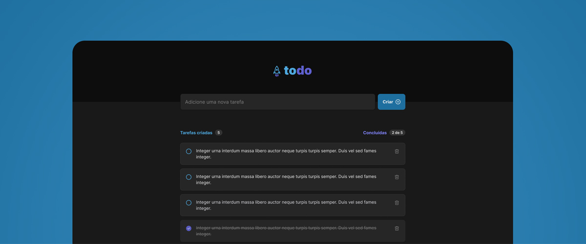

<div align="center">

</div>

<div align="center">


</div>

<h1 align="center">
ToDo
</h1>

<p align="center">
Aplicação simples para gerenciamento de tarefas
</p>

<div align="center">
<a href="#-sobre-o-projeto">Sobre</a> •
<a href="#-tecnologias">Tecnologias</a> •
<a href="#-preparando-o-ambiente">Preparando o ambiente</a> •
<a href="#-executando-a-aplicação">Executando a aplicação</a> •
<a href="#-licença">Licença</a>
</div>

## 📌 Sobre o projeto

Esta aplicação foi desenvolvida para auxiliar o usuário a gerenciar suas tarefas diárias. Ao acessar a aplicação o usuário poderá cadastrar uma nova tarefa e também poderá visualizar tarefas que ele criou anteriormente (caso existam), as tarefas exibidas na lista podem ser marcadas ou desmarcadas como concluídas e também excluídas. Ligeiramente abaixo do campo de inserção de uma nova tarefa é possível visualizar um sumário que informa a quantidade total de tarefas existentes e quantas das mesmas foram feitas. É importante lembrar que o usuário só poderá acessar a aplicação após estar autenticado.
O tema se adapta entre claro ou escuro dependendo das preferências do sistema operacional do usuário e o layout é completamente responsivo.

---

## 🧩 Tecnologias

<table>
<tr>
<td>

- [Next.js](https://nextjs.org/)
- [Typescript](https://www.typescriptlang.org/)
- [Tailwind CSS](https://tailwindcss.com/)
- [React Icons](https://react-icons.github.io/react-icons/)
- [Zustand](https://docs.pmnd.rs/zustand/getting-started/introduction)
- [React Hook Form](https://react-hook-form.com/)
</td>
<td>

- [Zod](https://zod.dev/)
- [Clerk](https://clerk.com/)
- [Axios](https://axios-http.com/docs/intro)
- [Prisma ORM](https://www.prisma.io/)
- [Postgres](https://vercel.com/storage/postgres)
</td>
</tr>
</table>

---

## 🌱 Preparando o ambiente

#### Instale os itens abaixo para clonar e executar o projeto corretamente!

- [Git](https://git-scm.com/)
- [Node](https://nodejs.org/)

#### Clone o repositório do projeto
```bash
git clone https://github.com/diegonatalo/todo.git

# Navegue para dentro da pasta do projeto
cd todo

# Abra a pasta do projeto no vscode
code .
```

#### Crie o arquivo ```.env.local```
> Configure as variáveis de ambiente seguindo o exemplo deixado em ```.env.example```

---

## ⏩ Executando a aplicação

```bash
# Instale as dependências:
npm i

# Inicie a aplicação:
npm run dev
```

---

## 📜 Licença

Distribuído sob a licença MIT. Veja [LICENSE](LICENSE) para mais informações.

---

<p align="center">Feito com ❤️ por Deigo Natalo.</p>
